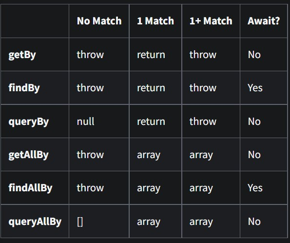

# React Testing

React provides React Testing library and Jest to test your react app by default.

- [React testing library](https://testing-library.com/docs/react-testing-library/intro) - provides virtual DOM for tests
- [Jest](https://jestjs.io/docs/tutorial-react) - test runner that finds tests, run tests, determines whether tests pass or fail

## What you need to test?

- Component rendering, props
- User interaction
- Conditional rendering
- Util & Hook
- API request, response

## How to run test?

1. Run all test files

```
npm test
```

2. Run some files

```
npm test -- <filename1> <filename2> <filenameN>
```

## Testing Playground

Useful chrome extension for create tests. You can get suggested query by hover on that element and this extension will show selection code for it. Then, you copy and paste in your tests.

## Basic command



- `render()`- render component in virtual DOM
- `screen.debug()` - show html DOM while testing to improve understanding
- `screen.getByText()` - find by element text content
- `screen.getByRole('button', {name})` - get element by tag like listitem(li), heading(h1-h6)
- `screen.findByRole('button', {name})` - like getByRole but be used for async/await
- `screen.getByTestId('testId')` - find element by `data-testid` tag
- `screen.getByLabelTest()` - find by label or aria-label text content
- `screen.getByPlaceholderTest()` - find by input placeholder value
- `screen.getByDisplayValue()` - find by form element current value
- `expect().not.toHaveLength(0)` - expect element not to have 0 length
- `expect().toHaveTextContent('')` - expect element to have wanted text
- `expect().toBeInTheDocument()` - expect element to exist on the DOM

## Unit testing

Test individual component like component rendering. There are three principles for creating tests:

1. Arrange - render component, prepare things
2. Act - do event like click, insert text
3. Assert - expect the results you want to be.

```js
// example 1
import { render, screen } from '@testing-library/react';
import User from './User';

test('on initial render', () => {
  render(<User key="1" name="carlos" email="example@hotmail.com" />);
  screen.debug();
});
```

```js
// example 2
import { render, screen } from '@testing-library/react';
import User from './User';

test('on initial render', () => {
  render(<User key="1" name="carlos" email="example@hotmail.com" />);
  expect(screen.getByRole('button', { name: /buy/i })).toBeEnabled();
});
```

## Asynchronous Tests

1. Test data fetching

```js
import React from 'react';
import { render, screen } from '@testing-library/react';
import App from './App';

describe('Testing App Component', () => {
  it('loading text is shown while API request is in progress', () => {
    render(<App />);

    const loading = screen.getByText('Loading...');
    expect(loading).toBeInTheDocument();
  });

  it('username is shown after API request', async () => {
    render(<App />);

    const listItemElements = await screen.findAllByTestId('name');
    expect(listItemElements).not.toHaveLength(0);
  });
});
```

Tip: describe() should not has async callback function, but it() can has async callback function

## User Event

```js
import React from 'react';
import { render, screen } from '@testing-library/react';
import userEvent from '@testing-library/user-event';
import App from './App';

describe('Testing App Component', () => {
  it('delete a user when clicked delete button', async () => {
    render(<App />);

    const deleteButton = await screen.findAllByRole('button');
    const firstUser = screen.getAllByTestId('name')[0];
    userEvent.click(deleteButton[0]);
    expect(firstUser).not.toBeInTheDocument();
  });
});
```

## Query element with data-testid attribute

`data-*` attribute is used to store custom data private to the page or application such as `data-testid` for making tests easier.
